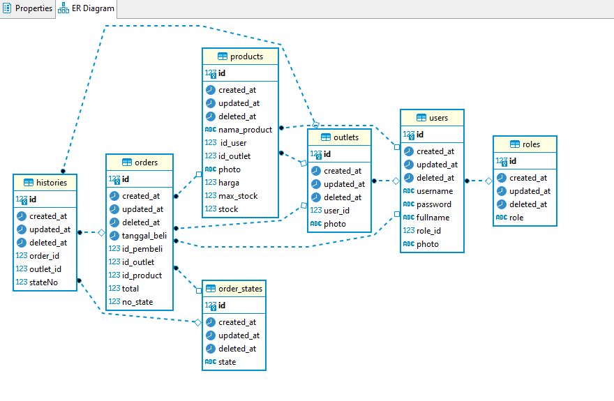
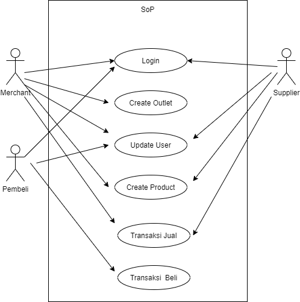
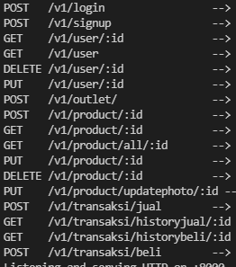

# Majoo Test

This repository use Golang and docker-compose
You can use this API for Majoo Test

## How To Build
1. Change env in each repository for database.
2. Build this project using command `docker-compose up -d`.
3. Run with `go run main.go`
4. Database and Seeder automigrate
5. Open with `http://localhost:8000/v1`

## Database Architecture (ERD)

## Use Case

## API

## Login System use Seeder
1. `{"username":"Afif", "password":"1234"}` as Merchant
2. `{"username":"Fifa", "password":"1234"}` as Supplier
3. `{"username":"Fif", "password":"1234"}` as Pembeli

## Maintenance
Developer : AFIF MUSYAYYIDIN